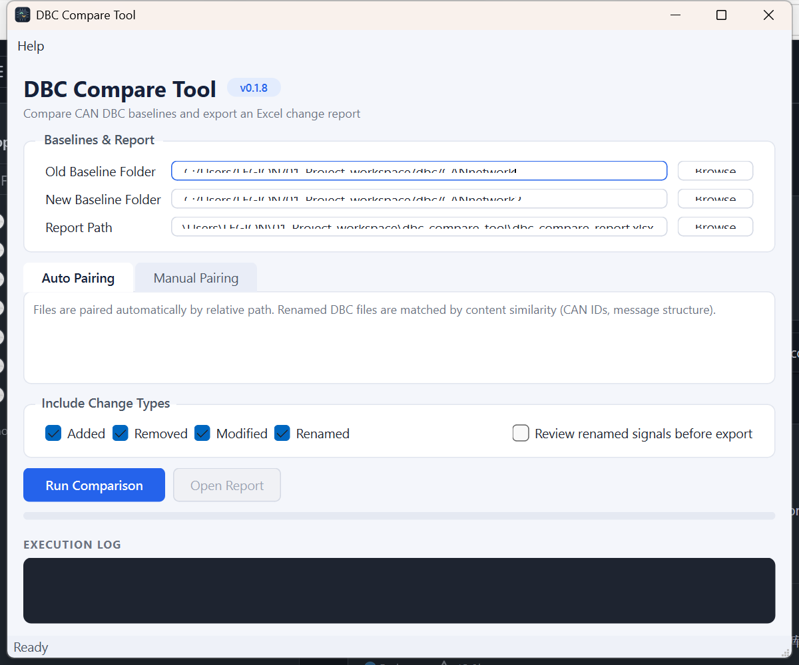

# DBC Compare Tool

[](https://github.com/longvo92/dbc-compare-tool/actions/workflows/test.yml)
[](LICENSE)
[](https://www.python.org/)
[](#requirements)

Desktop utility for comparing Automotive CAN DBC baseline folders and generating an engineering-grade Excel change report.

Point it at an old baseline folder and a new one; it discovers every `.dbc` file, pairs the files (even renamed ones), detects added / removed / modified / renamed messages and signals, and writes a single multi-sheet `.xlsx` report.

A second tab answers a different question: **what changed for the software on one ECU?** Pick the node, give it the list of signals the application uses, and the report covers the signal contract only — data type, scaling, range, unit, value table, init value, direction.



- [Features](#features)
- [Signal Focus](#signal-focus)
- [Report layout](#report-layout)
- [Requirements](#requirements)
- [Install](#install)
- [Usage](#usage)
- [Development](#development)
- [Documentation](#documentation)

## Features

- **Two comparison modes** — **Baseline Compare** reports every message and signal change between two baselines; **Signal Focus** reports what changed for one ECU node's signals, from an application point of view.
- **Folder-level comparison** — recursively discovers all `.dbc` files in both baselines.
- **DBC file pairing** — matches files by relative path first, then by CAN ID overlap and message-layout similarity, so a renamed `.dbc` is still compared as the same file.
- **Manual pairing** — a **Manual Pairing…** dialog lets you choose the new-baseline counterpart for each old file when automatic pairing is not what you want.
- **Message rename detection** — including messages whose CAN ID changed, scored over DLC, transmitter, cycle time, and signal layout.
- **Signal rename detection** — scored over start bit, length, byte order, signedness, factor/offset, unit, and receivers, with name similarity as supporting evidence. Event Matrix-style messages, where those properties are identical across dozens of signals, switch to a name-driven mode that can never report High confidence.
- **Rename review** — **Run Manual Compare** shows every detected signal rename with its confidence before export; reject one and it is reported as Removed + Added instead.
- **Value tables and comments** — `VAL_` and `CM_` differences are compared for both messages and signals.
- **Change-type filter** — include only Added / Removed / Modified / Renamed in the report.
- **Robust parsing** — an unparsable DBC is flagged `Parse Error` and the rest of the comparison continues; unusual encodings (UTF-8 with/without BOM, CANdb++ default) are handled.
- **CLI mode** — same comparison engine, scriptable for CI or batch runs.

## Signal Focus

An AUTOSAR application SWC does not see frames. It reads and writes signals through the RTE, so the only thing that can break it is the signal contract: width, value type, scaling, range, unit, value table, init value, and whether the ECU sends or receives the signal. The **Signal Focus** tab compares exactly that, keyed by signal name inside one selected ECU node.

Workflow:

1. Select both baseline folders and click **Load & Pair DBC** — files are paired with the same rules as the baseline comparison, renamed files included.
2. Pick the ECU node on each side of every pair. **Apply First Node To All** copies one choice to every pair that offers the same node name.
3. Paste the application's signal list, or import it from a `.txt`/`.csv`. Comment lines (`#`, `//`) and extra columns are ignored. Leave it empty to audit every signal of the node.
4. **Run Signal Compare**. The result opens in its own window — filterable, sortable, and holding the **Export Excel** button. Rows default to the order of your signal list.

Each signal gets one status:

| Status | Meaning |
|---|---|
| `Removed` | Gone from the DBC — application code breaks. A new signal with an identical contract is named in the note as a possible rename |
| `Modified` | Data type, scaling, range, unit, value table, or init value changed |
| `Added` | New signal for this node |
| `Direction Changed` | The node now sends what it used to receive, or the reverse |
| `Out Of Node Scope` | Still in the DBC, but no longer routed to or from the selected node |
| `Ambiguous` | The same name is defined more than once with different properties — pick the intended one manually |
| `Not In DBC` | In the signal list but in no compared DBC — usually a typo in the list |
| `Moved` | Only the carrier frame, CAN ID, or bit position changed; the application interface is unaffected |
| `Unchanged` | No application-relevant difference |

Start bit, byte order, CAN ID, DLC, cycle time, and transmitter never make a signal `Modified` — they belong to the COM layer, and reporting them buries the findings that matter.

## Report layout

The Baseline Compare tab writes one Excel workbook, five sheets:

| Sheet | Contents |
|---|---|
| `Summary` | Total change counts by category, report title, generation time |
| `DBC Overview` | One row per file pair: status (`Matched` / `DBC Added` / `DBC Removed` / `DBC Renamed` / `Manually Paired` / `Parse Error`), pairing confidence, message/signal counts |
| `Message Details` | Every added, removed, modified, or renamed message |
| `Signal Details` | Every added, removed, modified, or renamed signal |
| `Property Diff` | Before/after row for each changed property |

Rows are color-coded by change type (green = Added, salmon = Removed, yellow = Modified, blue = Renamed). CAN IDs are shown in hexadecimal (`0x1A3`).

The Signal Focus tab writes its own workbook, four sheets:

| Sheet | Contents |
|---|---|
| `Signal Focus Summary` | Selected node per DBC pair, signal-list size, count per status, and how many signals need review |
| `Signal Focus` | One row per signal: status, direction, current properties, carrier frame before and after, changed properties, note |
| `Property Diff (App)` | Before/after row for each changed application property |
| `Value Table Diff` | One row per changed `VAL_` entry, marked `Relabeled` / `Value Added` / `Value Removed` |

## Requirements

- Windows (the UI and path handling target Windows; the core engine is platform-agnostic)
- Python 3.10 or newer
- Runtime dependencies: `cantools`, `openpyxl`, `PySide6` (`pyinstaller` is needed only for `scripts/build.py`)

## Install

Ready-to-run builds are attached to each [release](https://github.com/longvo92/dbc-compare-tool/releases) — download the one-file `.exe` and nothing needs to be installed on the machine.

From source:

```powershell
git clone https://github.com/longvo92/dbc-compare-tool.git
cd dbc-compare-tool
py -m venv .venv
.\.venv\Scripts\python.exe -m pip install -r requirements.txt
.\.venv\Scripts\python.exe -m pip install -e .
```

The `-e .` step is required: the package lives under `src/`, so `python -m dbc_compare_tool` only resolves after an editable install. It also installs two commands on the `PATH` of the environment: `dbc-compare-tool` (CLI) and `dbc-compare-tool-gui` (desktop app).

## Usage

GUI:

```powershell
.\.venv\Scripts\python.exe -m dbc_compare_tool
```

CLI:

```powershell
.\.venv\Scripts\python.exe -m dbc_compare_tool.cli --old path\to\old --new path\to\new --out report.xlsx
```

All three CLI arguments are required and `--out` must end in `.xlsx`. Exit codes: `0` success, `1` parse or write failure, `2` bad arguments or missing folder.

Quick launchers `run_gui.bat` and `run_cli.bat` at the repository root do the same, using `.venv` in the repo.

Sample baselines for a first run live in [examples/old](examples/old) and [examples/new](examples/new).

## Development

Run the test suite:

```powershell
.\.venv\Scripts\python.exe -m unittest discover -s tests
```

CI runs the same suite on Linux and Windows against Python 3.10 and 3.12, plus a CLI comparison of the bundled example baselines. The comparison engine and the report writers have no UI dependency, so those runs install `cantools` and `openpyxl` only — no test imports Qt.

Build distributables (zipapp and/or one-file `.exe`):

```powershell
.\.venv\Scripts\python.exe scripts\build.py        # both
.\.venv\Scripts\python.exe scripts\build.py exe    # PyInstaller one-file exe
```

### Releasing

Two moves, on purpose.

1. A normal pull request bumps the version in `src/dbc_compare_tool/__init__.py` and `pyproject.toml`, and adds the `## Version X.Y.Z` section at the top of [resources/help/release_notes.md](resources/help/release_notes.md). Check it before pushing:

```powershell
.\.venv\Scripts\python.exe scripts\release_check.py 0.2.0
```

2. Once that is merged, trigger the release workflow against `main`. It builds the `.exe` and the zipapp on Windows, runs the suite and the CLI smoke test, and starts both artifacts to catch a bundle that is missing a module:

```bash
gh workflow run release.yml -f version=0.2.0
```

That is a rehearsal: it verifies and uploads the artifacts without creating anything permanent. Add `-f publish=true` to tag `v0.2.0` and create the GitHub release. The workflow never edits the repository, and refuses a version that disagrees with the merged files or that was already tagged.

### Project Structure

```
src/dbc_compare_tool/
├── core/
│   ├── discovery.py       # .dbc file discovery in a baseline folder
│   ├── parser.py          # cantools-backed parser: messages, signals, multiplexing,
│   │                      # extended IDs, nodes, value tables, comments, attributes
│   ├── models.py          # dataclasses for parsed and compared entities
│   ├── comparator.py      # folder- and database-level comparison orchestration
│   ├── rename.py          # rename detector interfaces and structural detectors
│   └── signal_focus.py    # node-scoped, signal-centric comparison
├── report/
│   ├── excel.py               # baseline Excel report
│   ├── signal_focus_excel.py  # signal focus Excel report
│   └── _style.py              # shared Excel styling
├── ui/
│   ├── main_window.py         # PySide6 desktop application, tab host
│   ├── signal_focus_panel.py  # Signal Focus tab
│   └── widgets.py             # shared Qt widgets
└── cli.py                 # command-line entry point
```

The CLI covers the baseline comparison only; Signal Focus is a UI workflow over the same engine.

The comparison engine has no UI dependency. See [docs/architecture.md](docs/architecture.md) for the rename-scoring strategy and known limitations.

## Documentation

- [User Guide](resources/help/user_guide.md) — step-by-step usage, also in the app's Help menu
- [Release Notes](resources/help/release_notes.md) — full changelog
- [Architecture](docs/architecture.md) — layers, data flow, rename scoring weights, validation status

## Contributing

Issues and pull requests are welcome. Please add a test under `tests/` for any change to the comparison or rename-detection logic, and keep the engine free of UI imports so it stays usable from the CLI and CI.

## Author

**Long Vo Thien**

## License

[MIT](LICENSE) © Long Vo Thien
