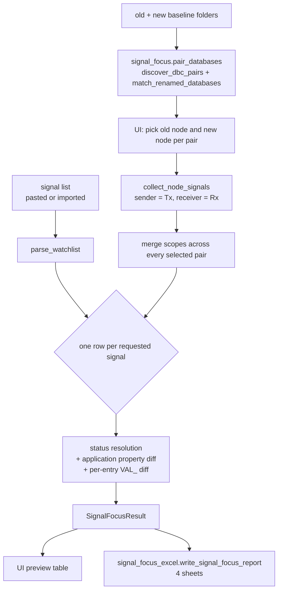
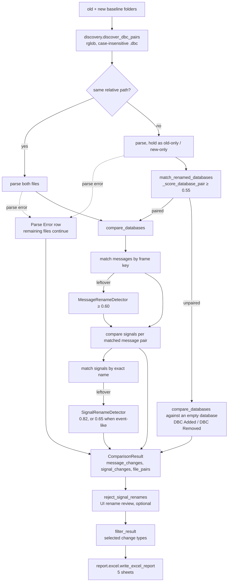

# Architecture

## Goals

This project is a local Windows desktop application for automotive engineers comparing DBC releases. The core comparison logic is kept independent from the UI so it can be tested and reused from CLI.

## Layers

1. Parser
   - Reads `.dbc` files through cantools.
   - Extracts messages, signals, multiplexing metadata, extended-frame state, value tables (`VAL_`), comments (`CM_`), and common message cycle-time attributes.
   - Also extracts what the node-scoped comparison needs: the ECU node list (`BU_`, falling back to
     every node referenced as a sender or receiver when the section is missing or empty), message
     senders as a list, and the signal init value (`GenSigStartValue`).
   - Keeps parsed output in small dataclasses.

2. Comparison Engine
   - Discovers `.dbc` files in old and new baseline folders.
   - Compares files with the same relative path first.
   - Pairs old-only and new-only `.dbc` files by CAN ID overlap and message-layout similarity.
   - Matches messages by frame key first; still-unmatched messages run through structural rename detection before being treated as added/removed.
   - Compares value tables and comments as regular properties, surfaced in change descriptions and the Property Diff sheet.
   - Accepts a caller-supplied pairing map (`compare_manual`) as an alternative to automatic file pairing.
   - Owns the two post-processing passes over a finished result: `filter_result` (keep only the requested change types, file pairs always preserved) and `reject_signal_renames` (turn a rename the user rejected back into a Removed + Added pair). Both live in the engine so the CLI and tests can reach them without importing the UI.

3. Rename Detection Engine
   - Messages with the same frame key and a different name are exact renames (confidence 1.0).
   - Messages whose frame key also changed are matched via `MessageRenameDetector`, a structural scorer over DLC, transmitter, cycle time, signal count, and signal-layout overlap (name similarity is minor supporting evidence).
   - Signals are compared inside an already-matched message pair — which includes a pair matched by message rename, so the two messages may carry different CAN IDs. Signals left over after exact-name matching are scored via `SignalRenameDetector`, with a relaxed name-driven mode for Event Matrix-style messages.
   - DBC file pairing still uses deterministic structural scoring so renamed `.dbc` files can be compared.

4. Signal Focus Engine (`core/signal_focus.py`)
   - A second, independent comparison keyed by **signal name inside one selected ECU node**, for
     application-layer work. It calls the parser, discovery, and the file-pairing helper of the
     baseline engine, but none of its message-matching or rename-detection logic.
   - `pair_databases` reuses `discover_dbc_pairs` and `match_renamed_databases` so both modes agree
     on what "the same DBC" is; the caller then picks the node per pair, per side.
   - Compares only application-visible properties and reports one status per signal
     (see [Signal Focus Semantics](#signal-focus-semantics)).

5. Report Generator
   - Writes a single Excel workbook per mode; shared styling lives in `report/_style.py`.
   - Baseline report — five sheets in order: `Summary`, `DBC Overview`, `Message Details`,
     `Signal Details`, and `Property Diff`.
   - Signal focus report — four sheets: `Signal Focus Summary`, `Signal Focus`,
     `Property Diff (App)`, and `Value Table Diff`. Deliberately a separate workbook: the two modes
     answer different questions, and merging the sheets would invite reading a signal-contract
     finding as a frame-level one.

6. UI Layer
   - PySide6 desktop UI with an application-wide stylesheet.
   - A tab host: **Baseline Compare** (folder-to-folder report) and **Signal Focus**
     (`ui/signal_focus_panel.py`). Both share the header and the progress bar; there is no persistent
     log panel — every progress and result message goes to the status bar via `_log()`, so the window
     only ever shows the latest step.
   - Each tab's controls sit in a `QScrollArea` so a small window scrolls instead of squeezing every
     group until its content is unreadable, and the tab's primary action stays outside that scroll
     area so it is always reachable. The Signal Focus result is a separate non-modal window
     (`SignalFocusResultWindow`) rather than a pane in the tab — nested vertical splitters left it
     one row tall, and a real signal list needs the whole screen.
   - Runs comparison, pairing, and export on worker threads to keep the UI responsive.
   - Persists last-used folder paths, the signal list, and both report paths via
     `QSettings("DbcCompareTool", "DBCCompareTool")` (Windows registry).
   - Help > Changelog renders `CHANGELOG.md`. That file lives at the repository root, which no build
     ships, so `scripts/build.py` copies it in beside the other resources and `_changelog_path()`
     falls back to the root copy in a source checkout.

The dependency direction is one-way: `ui` and `cli` both import `core` and `report`, and nothing
under `core` or `report` imports either of them. That is what lets CI run the full comparison with
`cantools` and `openpyxl` installed but no `PySide6` — and it is why no test imports Qt.

## Entry Points

| Entry point | Module | Notes |
|---|---|---|
| `dbc-compare-tool-gui`, `python -m dbc_compare_tool` | `ui/main_window.py` | Desktop app; `__main__.py` forwards to the UI |
| `dbc-compare-tool`, `python -m dbc_compare_tool.cli` | `cli.py` | `--old`, `--new`, `--out` all required; exit `0` ok, `1` parse/write failure, `2` bad arguments |

The CLI always uses automatic pairing and keeps every detected rename; manual pairing, rename
review, and Signal Focus are UI-only workflows built on the same engine calls.

## Build and Release

| Script | Role |
|---|---|
| `scripts/build.py` | Builds the one-file `.exe` (PyInstaller, resources bundled) and the `.pyzw` zipapp (resources copied next to it, because `_resource_path()` resolves to the folder containing the archive) |
| `scripts/release_check.py` | The release gate: version format, `__init__.py` and `pyproject.toml` agreeing with the version being released, `CHANGELOG.md` documenting it as the newest dated section, and nothing left under `[Unreleased]`. Also extracts that section for the GitHub release body |

Two workflows, deliberately split by who triggers them:

- `.github/workflows/test.yml` runs on every push and pull request to `main`: the suite plus a CLI
  comparison of the bundled examples, on Linux and Windows against Python 3.10 and 3.12. It installs
  `cantools` and `openpyxl` only, which is what keeps the no-Qt rule honest.
- `.github/workflows/release.yml` is `workflow_dispatch` only and refuses to run off `main`. It
  reads; it never writes to the repository. The default run is a rehearsal — build both artifacts,
  **start** both of them, upload, stop — and publishing takes an explicit `publish=true`. Starting
  the artifacts is the point: a PyInstaller bundle missing a module fails there and nowhere else,
  since the unit suite imports from source.

`CHANGELOG.md` is the single source for release notes: the app's Help menu, the `Changelog` link in
`pyproject.toml`, and the GitHub release body all resolve to it.

## Signal Focus Semantics

The baseline engine matches signals *inside* a message pair, so a signal that changed carrier frame
reads as a removal plus an addition. That is correct for a frame-level review and wrong for an
application-layer one, where the RTE hides frames entirely and only the signal contract can break
software. Signal Focus therefore keys on the signal name within the selected node and compares a
different property set.

| Compared (application contract) | Ignored (transport) |
|---|---|
| Length, value type | Start bit, byte order |
| Factor, offset | CAN ID, DLC |
| Min, max, unit | Cycle time, transmitter |
| Value table (`VAL_`), per entry | Message name — reported as `Moved`, not `Modified` |
| Init value (`GenSigStartValue`) | |
| Description (`CM_`) | |
| Direction (Tx/Rx) relative to the selected node | |

Byte order is deliberately on the ignore side: bit packing is the COM layer's problem, and reporting
it buries real findings under endianness churn. Moving it would mean adding it to `_app_properties`
in `signal_focus.py` and to the table above.

Status resolution order, per signal name: not found on either side → `Not In DBC`; the same name
defined more than once on one side with differing properties → `Ambiguous`; present on one side only
→ `Added` / `Removed`, or `Out Of Node Scope` when the name still exists in the new DBC but outside
the selected node; otherwise property or value-table differences → `Modified`, else a direction flip
→ `Direction Changed`, else a carrier change → `Moved`, else `Unchanged`.

Two behaviours are worth calling out. Value tables are diffed **per raw value** and classified as
`Relabeled` / `Value Added` / `Value Removed` — a relabelled raw value is the dangerous case, since
existing software still compiles and still reads the same number while the number now means something
else. And a `Removed` or `Added` signal carries a *note* naming any signal on the other side with an
identical application contract, as a possible rename; this never changes the status, because a
renamed signal breaks the application either way. There is no scored rename detection in this mode —
for the application layer the signal name **is** the contract, so exact-name matching with a
case-insensitive fallback is the whole matching strategy.

Signal names are merged across every selected DBC pair, so a signal moving from one bus to another
is `Moved`, not removed and added. Identical duplicates are merged with the locations listed in the
note; differing duplicates become `Ambiguous` rather than an arbitrary pick.

## Data Flow

Two details of that flow are easy to miss. An added or removed `.dbc` still goes through
`compare_databases`, paired against an empty `DbcDatabase`, which is how all of its messages and
signals reach the detail sheets instead of only the overview row. And a parse failure is contained
per file: the file becomes a `Parse Error` row in `file_pairs` and every other file is still compared.

## Rename Strategy

DBC file pairing prioritizes:

- CAN ID overlap
- Common message structural similarity
- Message-name overlap
- File-name similarity as supporting evidence only

Message rename detection prefers frame key equality; when the frame key also changes, unmatched messages fall back to `MessageRenameDetector` structural scoring (threshold 0.60).

Signal rename detection matches by **exact name** first. Every signal left unmatched on either side is then scored by `SignalRenameDetector` and resolved with greedy one-to-one matching. There is no separate bit-layout matching pass — bit layout enters the decision only as weighted criteria inside the score. `Signal.signal_key()` (`start_bit`, `length`) is used afterwards, and only to word the report description: a leftover signal whose key still exists on the other side is described as removed/added "after layout/name change" rather than a plain removal or addition.

### Frame key

Throughout the engine a message is identified by its **frame key** — the tuple `(can_id, is_extended_frame)`, not the raw CAN ID. The parser strips the extended-frame flag (`0x80000000`) from the ID it stores, so a standard frame and an extended frame can collapse onto the same number; keeping the flag in the key is what keeps them distinct.

## Scoring Reference

Every score below is a weighted sum of independent checks, capped at 1.0. A pair is only considered
a rename when its score reaches the detector's threshold. All weights are literal constants in the
source — this section is the authoritative description of them, so update both together.

Each weight set sums to exactly 1.0, so a perfect match on every criterion scores 1.0 and the weights
read directly as "share of the decision". The one exception is the event-like signal set, which tops
out at 0.88; that is explained below.

### DBC file pairing — `_score_database_pair` (comparator.py)

Applied only to files left over after relative-path matching. Threshold: `FILE_RENAME_THRESHOLD = 0.55`.
A pair scores 0.0 and is never paired when either database has no messages, or when the two share no
frame key at all.

| Criterion | Weight | Measure |
|---|---|---|
| CAN ID overlap | 0.55 | `common frame keys / max(old count, new count)`, keyed by `(can_id, is_extended_frame)` |
| Common-ID structure | 0.25 | Mean structure score over the shared frame keys (table below) |
| Message-name overlap | 0.15 | `common message names / max(old count, new count)` |
| File-name similarity | 0.05 | `SequenceMatcher` ratio over the lowercased relative paths |

Structure score per shared frame key — `_common_message_structure_score`:

| Criterion | Weight |
|---|---|
| DLC equal | 0.20 |
| Transmitter equal | 0.15 |
| Cycle time equal | 0.10 |
| Signal count equal | 0.15 |
| Signal-layout Jaccard | 0.40 × overlap |

Note the cycle-time check here is a plain equality test, unlike the one in `MessageRenameDetector`
below: two messages that both have an *unknown* cycle time count as matching and collect the 0.10.
That is deliberate for file pairing, where the comparison is over many messages at once and a shared
absence is still weak evidence of the same file, but it does mean a database with no
`GenMsgCycleTime` at all scores slightly higher than the criterion suggests.

Signal layout is the set of `(start_bit, length, byte_order)` tuples of a message's signals, compared
with a Jaccard index (`|A ∩ B| / |A ∪ B|`; two empty sets score 1.0, one empty set scores 0.0).

### Message rename — `MessageRenameDetector` (rename.py)

Reached only when the frame ID changed too: a message with the same frame key and a different name is
already an exact rename with confidence 1.0 and never goes through scoring. Threshold: **0.60**.

| Criterion | Weight |
|---|---|
| CAN ID equal | 0.35 |
| Signal-layout Jaccard | 0.22 × overlap |
| DLC equal | 0.12 |
| Signal count equal | 0.10 |
| Transmitter equal | 0.08 |
| Cycle time equal | 0.08 (skipped when the old cycle time is unknown) |
| Name similarity | 0.05 × ratio |

### Signal rename — `SignalRenameDetector` (rename.py)

Applied per matched message pair, to the signals left over after exact-name matching. Two weight
sets; the parent message decides which one is used — the event-like set is selected when *either*
the old or the new message is event-like.

| Criterion | Normal (threshold **0.82**) | Event-like (threshold **0.65**) |
|---|---|---|
| Start bit equal | 0.18 | 0.06 |
| Length equal | 0.18 | 0.06 |
| Byte order equal | 0.10 | 0.05 |
| Signedness equal | 0.06 | 0.03 |
| Factor equal | 0.12 | 0.04 |
| Offset equal | 0.12 | 0.04 |
| Unit equal | 0.08 | 0.04 |
| Receivers equal | 0.11 | 0.06 |
| Name similarity | 0.05 × ratio | **0.50 × ratio** |

The event-like column deliberately inverts the priority: in an Event Matrix message dozens of signals
share identical technical properties, so structure is nearly worthless as evidence and the name
carries the decision. Note the consequence — structural checks there total 0.38, so an event-like
match maxes out at 0.88 and can never be reported as High confidence.

A message counts as event-like (`EventMessageDetector.is_event_like`) when **all** of: it has at least
5 signals, at least 70% of them are ≤ 4 bits, and at least 60% share the same
`(length, byte_order, factor, offset, unit)` signature.

### Matching procedure and confidence

All old×new pairs are scored, those at or above the threshold become candidates, then candidates are
taken in descending score order with each old and each new item used at most once (greedy one-to-one).

Before that, ambiguity is penalised: when *n* old items are candidates for the same new item, each of
those candidates loses `0.15 × (n − 1)`, floored at 0.70, and gains an "Ambiguous" reason. Two details
follow from the order of operations — the penalty is applied *after* the threshold filter, so a
penalised pair can end up scoring below its own detector threshold and still be matched, and the 0.70
floor means an ambiguous match is never downgraded below Medium.

Confidence levels shown in the UI and report: **High** ≥ 0.90, **Medium** ≥ 0.70, otherwise **Low**.

## Validation Status

The tool has been exercised against real project DBC baselines of several kinds, not only the
bundled examples. The rename thresholds held up on that material and were **not** changed as a
result: DBC file pairing at `FILE_RENAME_THRESHOLD = 0.55`, `MessageRenameDetector` at 0.60, and
`SignalRenameDetector` at 0.82 (0.65 for event-like messages). Treat those numbers as field-confirmed
defaults rather than initial guesses; the weights behind them are documented under
[Scoring Reference](#scoring-reference).

What that field testing did **not** cover yet — these remain unvalidated outside the unit suite:

| Area | Status |
|---|---|
| CAN FD databases | Not exercised on real baselines |
| Extended / mixed frame IDs | Unit-tested only (`TestExtendedStandardFrameCollision` covers a standard frame hidden by an extended twin) |
| Multiplexed signals | Parsed and carried through comparison, but not exercised on real multiplexed baselines |
| Vendor attributes (`BA_`) beyond cycle time, very large databases | Not exercised |
| Signal Focus mode | Unit-tested only; not yet exercised on real project baselines |

### What the suite covers

One test module per layer, `unittest` only, no Qt import anywhere in `tests/`:

| Module | Layer |
|---|---|
| `test_parser.py` | Parsing, including byte order and value type against a mixed-endian fixture |
| `test_comparator.py`, `test_message_rename.py`, `test_rename.py` | Comparison and rename scoring |
| `test_manual_pairing_and_review.py` | Manual pairing and rename rejection |
| `test_value_and_comment.py` | `VAL_` and `CM_` comparison |
| `test_robustness.py` | Frame-key collisions, parse-error resilience, discovery, encodings |
| `test_signal_focus.py` | Node scoping, statuses, watchlist parsing, database pairing |
| `test_report.py` | Both Excel writers, written to disk and read back with openpyxl |
| `test_release_check.py` | The release gate, including against the real project files |

The suite was checked by mutation rather than by coverage percentage: 26 deliberate defects were
injected across the engine, the report writers and the models, and every one of them turned the
suite red. That pass is what added `test_report.py` — before it, either writer could raise on save
with the suite still green, which a release build would then have shipped.

## Known Risks

- `BA_` attributes other than `GenMsgCycleTime` and `GenSigStartValue` are not read at all, so a
  project that encodes meaning in custom attributes will see no diff for them. Surfacing one means
  extending the parser, the models, and the Property Diff sheet.
- CAN FD handling may still need project-specific interpretation — see the table above.
- The rename thresholds are a deliberate trade-off: at 0.60, `MessageRenameDetector` favours missing
  a CAN-ID-changed rename (reported as Removed + Added) over inventing a wrong one. Field use has not
  shown a reason to move it, but a project with heavy simultaneous ID-and-name churn may want it lower.
- Rename review in the UI is the intended safety net for the above: a detected rename can always be
  rejected before export, but a *missed* rename has no equivalent "merge these two" affordance.
- Signal Focus depends on node information the DBC may not carry. When `BU_` is missing or empty the
  node list is rebuilt from senders and receivers, which is accurate enough to select a node but says
  nothing about nodes that neither send nor receive anything. A DBC where receivers are left as
  `Vector__XXX` will show almost no Rx signals for any node — that is a data problem, not a tool one,
  but it looks like a tool one.
- Signal Focus matching is exact-name (case-insensitive fallback) by design. A renamed signal is
  reported as `Removed` plus `Added` with a possible-rename note, and there is no affordance to merge
  the two manually the way the baseline rename review lets you split one.
- There is exactly one rename change type, `Renamed`, graded by confidence level. An earlier
  `Possible Rename` type for ambiguous matches was removed once the confidence level made it
  redundant; do not reintroduce a second change type for uncertainty, since it splits the same
  information across two columns and every consumer of `change_type` then has to know about both.

## Incremental Roadmap

1. Core parser, comparison, rename detection, and Excel report. *(done)*
2. Desktop UI workflow. *(done)*
3. Message rename detection for CAN-ID changes, and value table/comment comparison. *(done)*
4. Real-project validation of the rename thresholds. *(done — thresholds unchanged)*
5. Node-scoped, signal-centric comparison for application-layer work. *(done)*
6. Coverage for the gaps listed under Validation Status, starting with CAN FD and multiplexed
   baselines.
